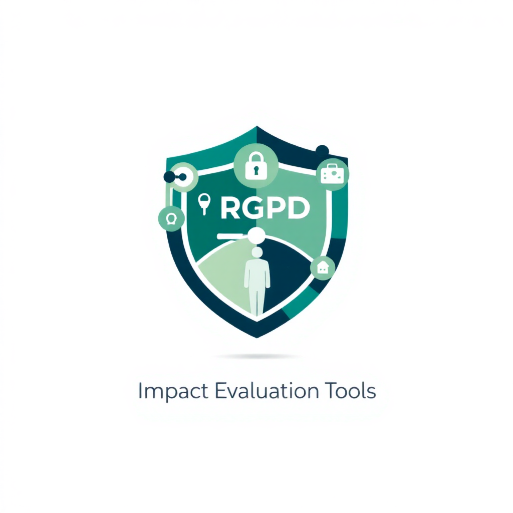

# Outil d'Évaluation d'Impact RGPD

Application web qui aide à déterminer si une notification à l'Autorité de Protection des Données (APD) est nécessaire suite à une violation de données, et prépare les documents requis selon les types de données qui auraient pu être exfiltrées et les articles du RGPD qui s'appliquent.

## Fonctionnalités

- ✅ **Évaluation rapide** de la nécessité de notifier l'APD
- 🔍 **Identification des articles du RGPD applicables** selon le type de données compromises
- 📝 **Génération automatique des documents** de notification et de documentation interne
- 🛤️ **Guide étape par étape** pour la gestion d'incidents liés aux données personnelles
- 📋 **Recommandations personnalisées** selon le type de violation et les données concernées


## Installation et exécution

### Méthode simple (sans installer)

1. Clonez le dépôt :
```bash
git clone 
https://github.com/servais1983/rgpd-impact-evaluation-tool.git
```

2. Ouvrez le fichier `index.html` dans votre navigateur web.

### Avec un serveur local

Si vous souhaitez utiliser un serveur local pour le développement :

1. Clonez le dépôt :
```bash
git clone 
https://github.com/servais1983/rgpd-impact-evaluation-tool.git
```

2. Naviguez dans le répertoire :
```bash
cd rgpd-impact-evaluation-tool
```

3. Si vous avez Python installé, vous pouvez démarrer un serveur HTTP simple :
```bash
# Python 3
python -m http.server 8000

# Python 2
python -m SimpleHTTPServer 8000
```

4. Accédez à l'application via : `http://localhost:8000`

## Comment utiliser l'outil

1. Sur la page d'accueil, cliquez sur le bouton "Commencer l'évaluation".
2. Remplissez les informations sur l'incident de sécurité (nature, date, etc.).
3. Sélectionnez les types de données personnelles qui ont été compromises.
4. Indiquez le nombre de personnes concernées et le niveau d'impact potentiel.
5. Décrivez les mesures déjà prises et celles prévues.
6. Soumettez le formulaire pour obtenir l'évaluation.
7. Consultez le résultat indiquant si une notification est nécessaire, et pourquoi.
8. Générez le document approprié (notification à l'APD ou documentation interne).

## Cadre juridique et articles du RGPD couverts

L'outil base son évaluation sur les exigences du Règlement Général sur la Protection des Données (RGPD), notamment :

- **Article 33** : Notification d'une violation de données à caractère personnel à l'autorité de contrôle.
- **Article 34** : Communication d'une violation de données à caractère personnel à la personne concernée.
- **Article 35** : Analyse d'impact relative à la protection des données.
- **Articles 5, 6, 9 et 10** : Principes relatifs au traitement et licéité du traitement, y compris pour les catégories particulières de données.
- **Article 32** : Sécurité du traitement.

## Types de violations couvertes

L'outil peut évaluer différents types de violations de données :

- **Accès non autorisé** : Personnes non autorisées ayant accédé aux données
- **Vol de données** : Exfiltration de données à des fins malveillantes
- **Perte de données** : Données devenues indisponibles
- **Altération de données** : Modification non autorisée des données
- **Divulgation non autorisée** : Partage de données avec des tiers non autorisés

## Types de données évaluées

L'évaluation prend en compte différentes catégories de données personnelles :

- **Données d'identification** : Nom, prénom, adresse
- **Coordonnées de contact** : Email, téléphone
- **Données financières** : Coordonnées bancaires, numéros de carte
- **Identifiants et mots de passe**
- **Documents d'identité officiels** : Passeport, CNI, etc.
- **Données sensibles (catégories particulières)** :
  - Données de santé
  - Données biométriques
  - Données génétiques
  - Orientation sexuelle
  - Condamnations pénales
  - Opinions politiques, convictions religieuses
  - Origine raciale ou ethnique

## Personnalisation

Vous pouvez personnaliser cet outil pour l'adapter à vos besoins spécifiques :

- Modifier les seuils de notification dans `js/rgpd-rules.js`
- Ajouter ou modifier les types de données dans `js/rgpd-rules.js`
- Personnaliser les modèles de documents dans `js/document-generator.js`

## Contributions

Les contributions à ce projet sont les bienvenues ! Vous pouvez :

1. Forker le dépôt
2. Créer une branche pour votre fonctionnalité (`git checkout -b feature/amazing-feature`)
3. Committer vos changements (`git commit -m 'Add some amazing feature'`)
4. Pousser vers la branche (`git push origin feature/amazing-feature`)
5. Ouvrir une Pull Request

## Licence

Ce projet est sous licence MIT. Voir le fichier `LICENSE` pour plus de détails.

## Avertissement

Cet outil est fourni à titre informatif et ne remplace pas un avis juridique professionnel. En cas de doute, consultez un avocat spécialisé en droit des données personnelles.

## Contact

Pour toute question ou suggestion, n'hésitez pas à ouvrir une issue sur ce dépôt GitHub.

---
Développé avec ❤️ pour aider les organisations à se conformer au RGPD et protéger les données personnelles.
